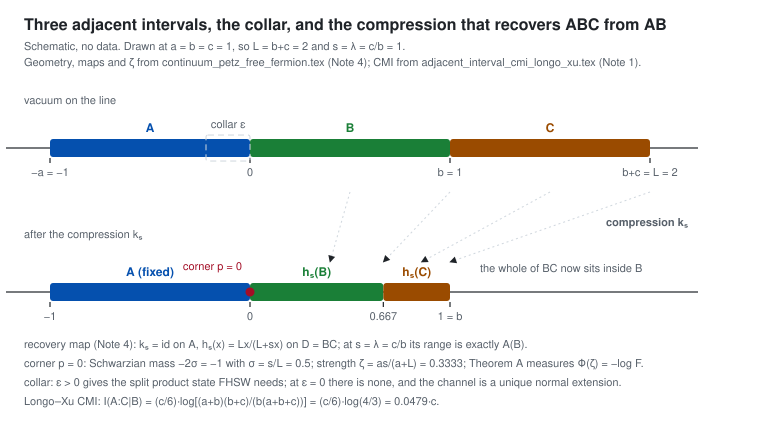
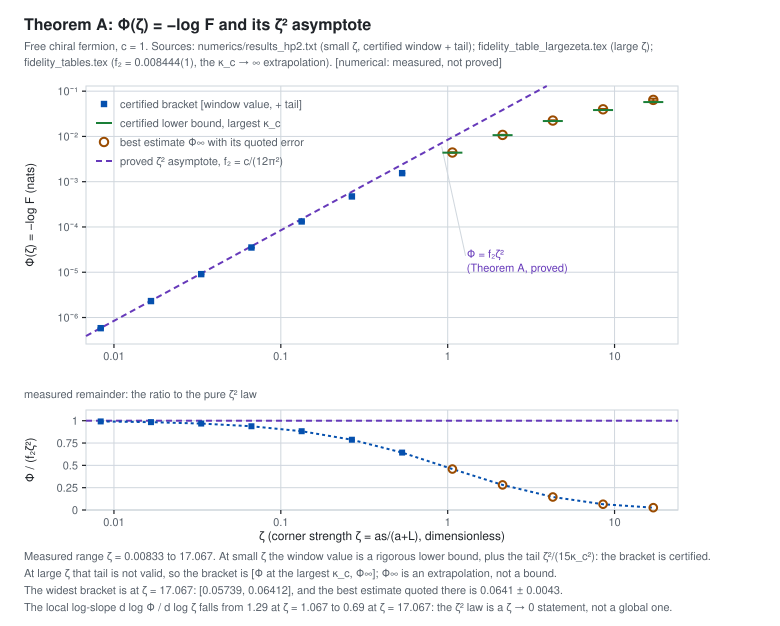
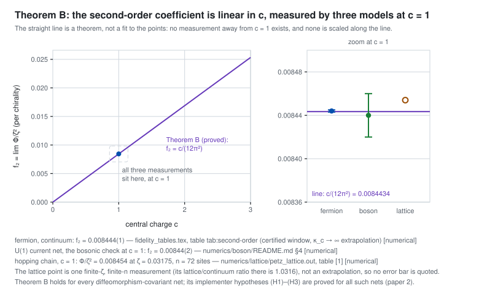
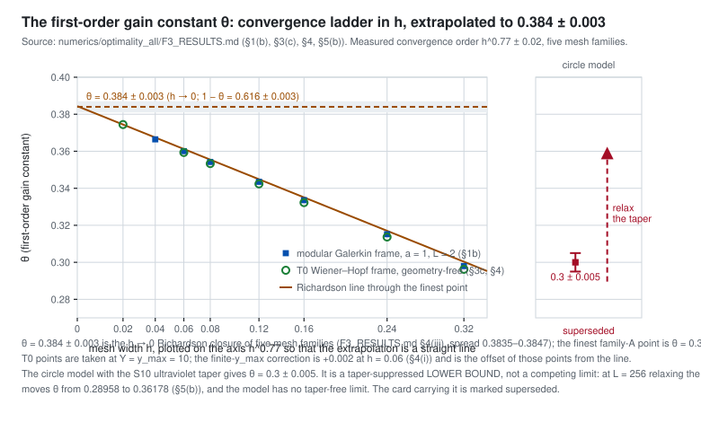
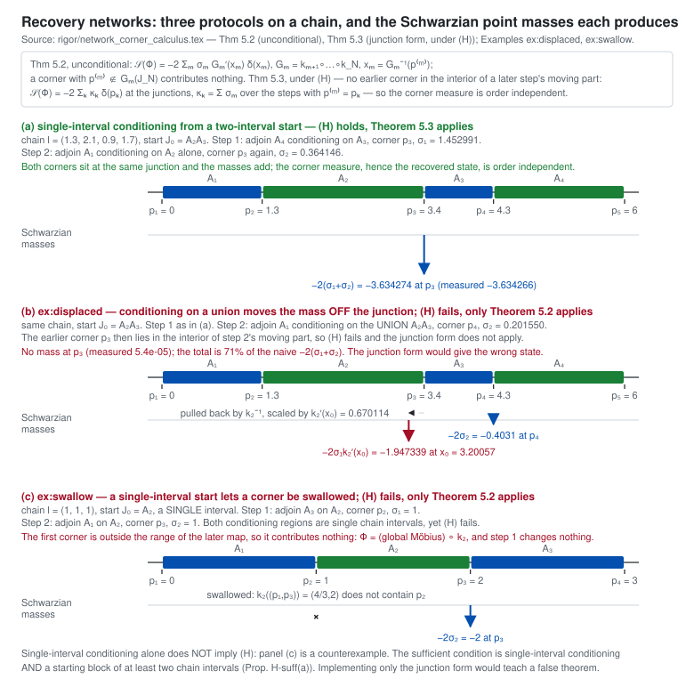
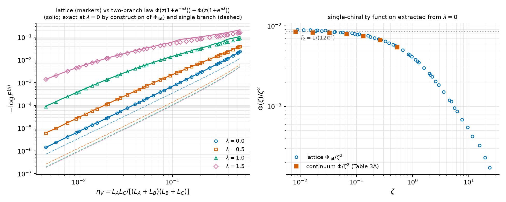
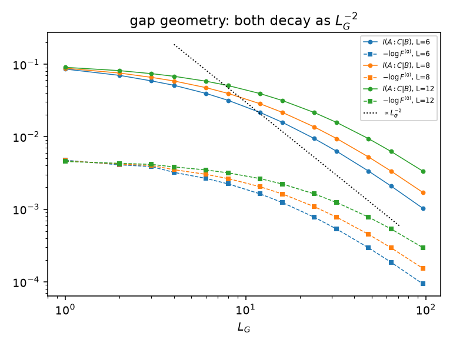
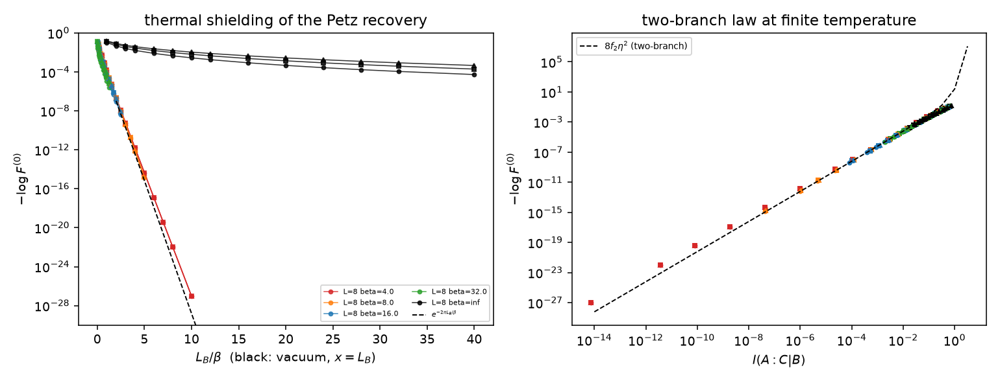
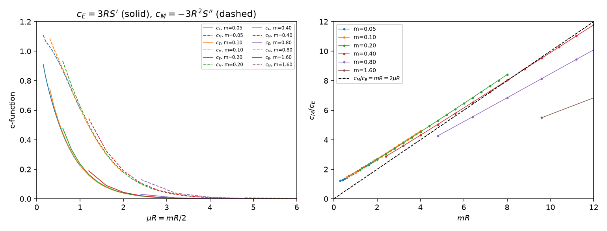

# Conditional mutual information of adjacent intervals as a quantum-Markov defect

Alexander Stottmeister, Institut für Theoretische Physik, Leibniz Universität Hannover.

For three adjacent intervals `A`, `B`, `C` in the vacuum of a chiral conformal field theory the
Longo–Xu conditional mutual information `I(A:C|B)` is finite and strictly positive, so the chain
`A–B–C` is not a quantum Markov chain. This project reads that number as the failure of a Petz
recovery map: it constructs the recovery channel directly at zero collar width in the type-III
setting, measures how well the channel works, proves that the leading error is universal, asks
whether any other channel does better, and extends the calculus to chains of intervals. The
answers are an exact quadratic law, a universality theorem, a conditional optimality value, and a
Schwarzian corner calculus for recovery networks.

## 1. The four headline results

| | result | status | where it is established |
|---|---|---|---|
| **A** | For the zero-collar geometric compression of the free chiral fermion, `Φ(ζ) := −log F` satisfies `Φ/ζ² → c/(12π²)` as `ζ → 0`. Rigorous lower bound from data processing, upper bound from an Uhlmann–Bogoliubov extension. | `refereed` | paper 1 ([release](https://github.com/alexander-stottmeister/cft-cmi/releases/latest)); [`rigor/quadratic_limit.tex`](rigor/quadratic_limit.tex) |
| **B** | The same coefficient `c/(12π²)` holds for **every** diffeomorphism-covariant net on the circle, under implementer hypotheses (H1)–(H3) that are themselves proved for all such nets. | `refereed` | paper 2 ([release](https://github.com/alexander-stottmeister/cft-cmi/releases/latest)); [`rigor/universality_theorem_B.tex`](rigor/universality_theorem_B.tex), [`rigor/implementation_C11.tex`](rigor/implementation_C11.tex) |
| **C** | Over *all* recovery channels the second-order optimum is a quasi-free convex programme with value `(1−θ)·c/(12π²)·ζ²` per chirality, `θ = 0.384 ± 0.003`. Non-isometric channels do not help. | `numerical`, and **conditional on H1, H2, H3** | [`rigor/exact_optimum_tangent_problem.tex`](rigor/exact_optimum_tangent_problem.tex), [`numerics/optimality_all/F3_RESULTS.md`](numerics/optimality_all/F3_RESULTS.md) |
| **D** | Sequential recovery along a chain composes to a `C¹` piecewise-Möbius map whose Schwarzian is a sum of negative point masses; the recovered state depends on the map only through that measure, and exact recovery never occurs. | `proved` (the junction form of the calculus holds **under hypothesis (H)**) | [`rigor/network_corner_calculus.tex`](rigor/network_corner_calculus.tex) |

The relative-entropy analogue `s₂ = c/12` remains `conjectural`, with a proved bracket, and one
gauge lemma that would have implied it is `refuted` here (§4).

**Status vocabulary**, used identically in every caption, table and document of this repository:
`proved` (a complete structured proof that an independent referee pass did not break), `refereed`
(proved and independently reviewed), `numerical` (a measurement with a stated error bar and a
convergence order), `verified`, `conjectural`, `open`, `refuted`, `superseded`. **Nothing labelled
`numerical` is a theorem.** A result that needs hypotheses names them where it is stated.

The papers are drafts. Their citable versions are the PDFs attached to the
[latest release](https://github.com/alexander-stottmeister/cft-cmi/releases/latest): `*.pdf` is a
gitignored build product, so a link to a path in the tree would be dead in a clone.

## 2. The picture

**Figure F1.** Original schematic; no data. `A = (−a,0)`, `B = (0,b)`, `C = (b,b+c)` on the chiral
line, drawn at `a = b = c = 1`. The zero-collar recovery map is `k_s = id` on `A` and
`h_s(x) = Lx/(L+sx)` on `D = BC`, `L = b+c`
([`continuum_petz_free_fermion.tex`](continuum_petz_free_fermion.tex), Note 4); at the compression
member `s = λ = c/b` its range is exactly `𝒜(B)`. The corner strength is `ζ = as/(a+L)`, the
Schwarzian mass at the corner is `−2σ` with `σ = s/L`
([`rigor/network_corner_calculus.tex`](rigor/network_corner_calculus.tex)), and the Longo–Xu value is
`I(A:C|B) = (c/6)·log[(a+b)(b+c)/(b(a+b+c))]`
([`adjacent_interval_cmi_longo_xu.tex`](adjacent_interval_cmi_longo_xu.tex), Note 1). A positive
collar `ε` between `A` and `B` supplies the split product state the FHSW rotated Petz map needs;
at `ε = 0` there is no normal product state, and the channel is obtained as the unique normal
extension of the positive-collar maps. Generated by
[`tools/make_figures.py`](tools/make_figures.py).

## 3. Result 1 — the exact quadratic law (Theorem A)

`proved`, `refereed`. The second-order coefficient is `f₂ = c/(12π²) = 0.0084434·c`
([`rigor/quadratic_limit.tex`](rigor/quadratic_limit.tex) Thm 4.2). The lower bound is the
Legendre form of the SLD metric plus data processing and the upper bound is Uhlmann with a
Bogoliubov extension of the compression to a circle diffeomorphism, so no interchange of limits
and no tail bound is needed. `proved`: the ultraviolet tail obeys
`0 ≤ Φ − Φ_W ≤ 0.173 ζ²/κ_c + 0.88 ζ²/κ_c²` for `κ_c ≥ max{10, 2log(1/ζ) + 2log(1+κ_c) + 3}`
([`rigor/tail_bound.tex`](rigor/tail_bound.tex) Thm 5.1).

`numerical`. The `κ_c → ∞` extrapolation of the certified window values gives `f₂ = 0.008444(1)`
and `s₂ = 0.0837(5)` at `c = 1` ([`fidelity_tables.tex`](fidelity_tables.tex), table
`tab:second-order`); the measured range of `ζ` is `0.0083` to `17.067`
([`numerics/results_hp2.txt`](numerics/results_hp2.txt),
[`fidelity_table_largezeta.tex`](fidelity_table_largezeta.tex)).

**Figure F2.** `numerical`, with the `ζ²` asymptote `proved`. Filled squares are certified
brackets: the value in the spectral window is a rigorous lower bound and the tail `ζ²/(15κ_c²)`
is added. Open circles are best estimates `Φ∞`, the `κ_c → ∞` extrapolations, with their quoted
errors; the green ticks are the certified lower ends. That tail correction is not valid at large
`ζ`, so there the bracket is `[Φ at the largest κ_c, Φ∞]` and `Φ∞` is an extrapolation, not a
bound: the widest case is `ζ = 17.067`, bracket `[0.05739, 0.06412]`, best estimate `0.0641(43)`.
The lower panel is the measured remainder `Φ/(f₂ζ²)`; the local log-slope falls from `1.29` at
`ζ = 1.067` to `0.69` at `ζ = 17.067`, so the `ζ²` law is a `ζ → 0` statement and not a global
one. All values from
[`fidelity_table_largezeta.tex`](fidelity_table_largezeta.tex),
[`numerics/results_hp2.txt`](numerics/results_hp2.txt) and
[`fidelity_tables.tex`](fidelity_tables.tex); figure by [`tools/make_figures.py`](tools/make_figures.py).

`open`. The certified enclosures refer to the compressed problem
([`rigor/certified_numerics.tex`](rigor/certified_numerics.tex)); the two-dimensional quadrature
producing the defect matrix and the truncation of the box frame are not yet certified (§8).

## 4. Result 2 — universality (Theorem B)

`refereed`. For every diffeomorphism-covariant net on `S¹` — separable, CDIT axioms,
Bisognano–Wichmann, Haag duality, Reeh–Schlieder — the second-order coefficient is `c/(12π²)`,
independent of the model ([`rigor/universality_theorem_B.tex`](rigor/universality_theorem_B.tex)).
The implementer hypotheses (H1)–(H3) the theorem uses are themselves `refereed` as holding for all
such nets ([`rigor/implementation_C11.tex`](rigor/implementation_C11.tex)).

**Figure F3.** The line is Theorem B, `proved`, not a fit: the three points are `numerical` and
all three were measured at `c = 1`, and none is scaled along the line. Free chiral fermion,
continuum: `f₂ = 0.008444(1)` ([`fidelity_tables.tex`](fidelity_tables.tex)). U(1) current net,
the bosonic check: `f₂ = 0.00844(2)` and `s₂ = 0.083(2)` against `0.0084434` and `0.0833333`
([`numerics/boson/README.md`](numerics/boson/README.md) §4). Half-filled hopping chain:
`Φ/ζ² = 0.008454` at `ζ = 0.03175`, `n = 72` sites — one finite-`ζ`, finite-`n` point whose
lattice/continuum ratio there is `1.0316`, not an extrapolation, so no error bar is quoted
([`numerics/lattice/petz_lattice.out`](numerics/lattice/petz_lattice.out), table [1]). Figure by
[`tools/make_figures.py`](tools/make_figures.py).

`conjectural`. The relative-entropy coefficient `s₂ = c/12` is not proved. The bracket
`0.0338c ≤ liminf s⁻²D ≤ limsup ≤ 0.924c` is not proved outright either: the upper end,
`(11+5√5)c/24 = 0.92418c`, holds under hypothesis (V), which is itself open, and the lower end
rests on results of Araki whose sources were NOT OBTAINED, so it too is carried as a hypothesis
(Gap RK2 of the same document)
([`rigor/kubo_mori_gauge_lemma.tex`](rigor/kubo_mori_gauge_lemma.tex)); the fermion measures
`0.0837(5)` and the boson `0.083(2)`, both consistent with `c/12 = 0.0833333`.

`refuted`. The gauge lemma that would have closed the gap by restriction to `𝒜(K)` is false; the
Kosaki and Petz–Donald variational expressions are suprema and give bounds in the wrong direction
([`rigor/kubo_mori_gauge_lemma.tex`](rigor/kubo_mori_gauge_lemma.tex)). The refutation is kept
rather than erased.

## 5. Result 3 — is the recovery optimal?

`numerical`. The zero-collar compression is **not** the second-order minimiser: that rests on
`θ > 0`, which is measured and not proved (card `compression-not-second-order-minimiser`).
`proved`: over all quasi-free channels the second-order problem is a convex tangent programme
([`rigor/optimality_all_channels.tex`](rigor/optimality_all_channels.tex),
[`rigor/exact_optimum_tangent_problem.tex`](rigor/exact_optimum_tangent_problem.tex),
[`rigor/exact_fidelity_upper_half.tex`](rigor/exact_fidelity_upper_half.tex)).

`numerical`, **conditional on H1, H2, H3**. That the optimum is attained on the isometric orbit
is itself conditional: the tangent document proves it modulo H1, H2, H3, with conditions (a) and
(e) verified on meshes rather than proved. The value of the optimum is
`E⁽²⁾ = (1−θ)·f₂·ζ²` per chirality with `θ = 0.384 ± 0.003`, i.e. `1 − θ = 0.616 ± 0.003`
([`numerics/optimality_all/F3_RESULTS.md`](numerics/optimality_all/F3_RESULTS.md) §4). The three
hypotheses are stated in
[`rigor/exact_optimum_tangent_problem.tex`](rigor/exact_optimum_tangent_problem.tex): **H1**
differentiability along the scaled family, **H2** minimisers within the scaled-family form, **H3**
the cone hypothesis reducing the whole cone of admissible generators to two boundary directions
(proved for vector fields, a declared hypothesis otherwise). Drop them and what remains is the
isometric upper bound together with the dual lower bound — with `θ` still numerical.

**Figure F4.** `numerical`. Two independent discretisations — the modular Galerkin frame at
`a = 1, L = 2` and the geometry-free T0 Wiener–Hopf frame — on the axis `h^0.77`, the measured
convergence order (`0.77 ± 0.02`, five mesh families). The `h → 0` Richardson closure is
`θ = 0.384 ± 0.003` (family spread `0.3835–0.3847`; finest point `θ = 0.37442` at `h = 0.02`).
Beside it, superseded by the reconciliation (though no card carries that status): the spectral
circle model with the S10 ultraviolet taper gives
`θ = 0.300 ± 0.005`, which is a **taper-suppressed lower bound**, not a competing limit —
relaxing the taper window at `L = 256` from `(0.30,0.42)` to `(0.35,0.47)` already moves `θ` from
`0.28958` to `0.36178`, and the model has no taper-free limit. All values from
[`numerics/optimality_all/F3_RESULTS.md`](numerics/optimality_all/F3_RESULTS.md); figure by
[`tools/make_figures.py`](tools/make_figures.py).

`open`. `θ` is the value of a parameter-free quadratic Wiener–Hopf problem, and no closed form is
claimed. Twenty-six closed-form candidates were tested against the window `[0.381, 0.387]`; three
fall inside, `0.28` hits are expected by chance, and **no selection is made** — a closed form has
to come from solving the Wiener–Hopf problem, not from fitting
([`numerics/optimality_all/F3_RESULTS.md`](numerics/optimality_all/F3_RESULTS.md) §6). That
`θ < 1` is also not proved.

## 6. Result 4 — networks and the corner calculus

`proved`. For a one-sided zero-collar protocol on a chain `A₁ … Aₙ`, every step is a parabolic
compression towards a corner, and the composite point map `Φ = k₁ ∘ … ∘ k_N` is `C¹` piecewise
Möbius. **Theorem 5.2, unconditional:** `𝒮(Φ) = −2 Σₘ σₘ Gₘ′(xₘ) δ(xₘ)` with
`Gₘ = kₘ₊₁ ∘ … ∘ k_N` and `xₘ = Gₘ⁻¹(p⁽ᵐ⁾)` — the mass sits at the *preimage* of the junction and
is scaled by the *derivative* of the later maps, and a corner outside the range of `Gₘ`
contributes nothing. **Theorem 5.3, under hypothesis (H)** — no earlier corner lies in the
interior of a later step's moving part — the masses collapse onto the junctions,
`𝒮(Φ) = −2 Σₖ κₖ δ(pₖ)`, and the corner measure is order independent
([`rigor/network_corner_calculus.tex`](rigor/network_corner_calculus.tex)).

**Figure F5.** `proved`; the junction form of panel (a) is **conditional on (H)**. Panel (a):
single-interval conditioning from a two-interval start satisfies (H), both corners land on `p₃`
and the masses add, `−2(σ₁+σ₂) = −3.634274` against a measured `−3.634266`. Panel (b),
Example `ex:displaced`: conditioning on the union `A₂A₃` breaks (H); the first mass moves off the
junction to `x₀ = 3.200568` scaled by `k₂′(x₀) = 0.670114`, there is no mass at `p₃`, and the total
is `71%` of the naive value. Panel (c), Example `ex:swallow`: a single-interval *start* also
breaks (H), the first corner falls outside the range of the later map and is swallowed, so
`𝒮(Φ) = −2δ(p₃)` and the first step leaves the state unchanged. Single-interval conditioning alone
therefore does **not** imply (H); the sufficient condition is single-interval conditioning *and* a
starting block of at least two chain intervals. All values from
[`rigor/network_corner_calculus.tex`](rigor/network_corner_calculus.tex) (Thm 5.2, Thm 5.3,
Examples `ex:displaced`, `ex:swallow`); figure by [`tools/make_figures.py`](tools/make_figures.py).

`proved`. Two consequences. **Rigidity:** `ω ∘ β_Φ = ω` iff `Φ` is Möbius iff `𝒮(Φ) = 0`; all the
masses are negative and the last step is never swallowed, so exact recovery never occurs for any
protocol whose last step keeps a non-empty part — unconditionally, without (H) and without the
second-order law. **Holonomy:** under (H), that is with single-interval conditioning and a starting block of at
least two chain intervals, the corner measure, hence the recovered state, depends only on the
starting block, so the `2ⁿ⁻²` protocols starting from an adjacent pair fall into exactly `n−1`
classes ([`rigor/network_corner_calculus.tex`](rigor/network_corner_calculus.tex), Prop. 9.1 and
Lem. 9.2, tabulated there for `n = 4, 5`). VWZ Protocol 3 equals the over-compressed
Theorem-A map up to post-composition with a global Möbius map, which is why the two agree as
fidelities and differ as point maps.

`conjectural`. The second-order network law `Φ_tot = Σ ζⱼζₖ G(yⱼ−yₖ)` with a universal kernel
(card `network-second-order-law`), and the VWZ four-interval ordering `Φ(1):Φ(2):Φ(3) → 1:2:4`
(card `vwz-protocol-ordering`, where the `1:4` half is unconditional given the corner calculus and
the `1:2` half needs the network law with a uniform remainder), are conjectures.

## 7. Beyond the vacuum: lattice, thermal, massive flow, gap geometry

The four figures below are `numerical`, kept as PNG where they are and not regenerated by
`tools/make_figures.py`.

**Two-branch law on the lattice.** Gaussian rotated Petz maps on the half-filled
hopping chain in ball arithmetic, up to 72 sites: the apparent exponents `p` of `−log F ~ η^p` are
`1.986, 1.912, 1.635, 1.151` at `λ = 0, 0.5, 1, 1.5`, against Vardhan–Wei–Zou's `2.00, 1.90, 1.70,
1.20` (table [3]). The two-branch prediction built from the lattice `Φ` itself reproduces
`−log F` to within 3% over the nine geometries with `η_V ≤ 0.02`: ratio `0.9686`–`0.9953` at
`λ = 0.5`, `0.9715`–`0.9907` at `λ = 1`, `0.9795`–`0.9917` at `λ = 1.5` (table [2]). The window
matters: over all 52 geometries the ratio falls to `0.82`, `0.64` and `0.41`. The `λ = 0` entry is
`1.0000` by definition, since `Φ_lat` is defined as `½(−log F⁰)` there. And the fixed-`L` two-branch ratio drifts as `1 − 0.15/L`
(measured `L(1−ratio) = 0.1525, 0.1444, 0.1357` at `L = 4, 6, 8`, table [8])
([`numerics/lattice/petz_lattice.out`](numerics/lattice/petz_lattice.out)).

**Figure F6.** `numerical`. Log–log collapse of the two-branch law, generated by
[`numerics/lattice/petz_lattice.py`](numerics/lattice/petz_lattice.py) (`plot`).

**Thermal shielding.** In KMS states `−log F⁽⁰⁾` and `I(A:C|B)` decay exponentially
in `L_B/β` with rates approaching `2π` and `π`: measured `κ_F = 5.863, 6.237, 6.293` at
`β = 4, 8, 16` against `2π = 6.28319`, and `κ_I = 3.129, 3.159, 3.150` against `π`
([`numerics/lattice/README.md`](numerics/lattice/README.md), §1).

**Gap geometry.** With a gap `G` between `A` and `B` the massless Dirac field gives
exactly `I(A:C|B) = (1/3)·log[(a+g+b)(g+b+c)/((g+b)(a+g+b+c))]`, the adjacent law with
`L_B → L_B + L_G`; measured `I/I_cont = 1.0006` at `L_G = 96, L = 12`, and `−log F⁽⁰⁾/I` tends to
an `L`-independent constant `κ_g ≈ 0.09` ([`numerics/lattice/README.md`](numerics/lattice/README.md), §3).

**Figure F7.** `numerical`. Gap decay and thermal shielding, generated by
[`numerics/lattice/petz_thermal_rg.py`](numerics/lattice/petz_thermal_rg.py).

**Massive flow.** Along the massive Dirac flow the Markov c-function `c_M` and the
entropic `c_E` both fall monotonically to zero with `c_M ≥ c_E` everywhere; at `m = 0`, `R = 40`
the normalisation is `c_E = 1.00090` and `c_M = 1.00144`, and in the infrared `c_M/c_E → mR`
(measured `(c_M/c_E)/(mR) = 1.02` at `m = 0.4, R = 16`)
([`numerics/lattice/README.md`](numerics/lattice/README.md), §2).

**Figure F8.** `numerical`. The Markov c-function along the massive flow, generated by
[`numerics/lattice/petz_thermal_rg.py`](numerics/lattice/petz_thermal_rg.py).

## 8. What is open

Five items carry status `open`. Their titles and next steps are reproduced verbatim from the
knowledge base so that they cannot drift; the full statements are in [`docs/open.md`](docs/open.md),
generated from the same source.

1. **Charged sectors, state dependence, collar Gaussianity (O11)** — *Deferred throughout Phases
   1-3.*
   `next:` Sector-dependent Markov defect for the free fermion (quasi-free or finite rank); write
   the half-page collar-Gaussianity lemma.
2. **Multi-interval networks (O10, second half)** — *Not started. The gap geometry is done;
   networks of recovery maps and their holonomy remain.*
   `next:` Phase 6 (rigor/phase6_brief.md, card phase6-plan): corner calculus (G1a), second-order
   network law with the universal kernel Ghat (G1b), lattice sequential Petz chains and the VWZ
   protocol test 1:2:4 (G2), Ghat(Delta) in two frames (G3).
3. **The universal corner-correlation kernel Ghat(Delta): closed form, positivity, decay**
   `next:` G1b + G3 in parallel.
4. **theta as a geometry-free Wiener-Hopf constant in the modular frame of I**
   `next:` Solve or bound the Wiener-Hopf problem of Prop 6.2 and compare with theta = 0.384 +-
   0.003 (F3 is done); a closed form is open, and no candidate is to be fitted to the numerics
5. **Certify the defect-matrix quadrature and the box cutoff** — *The certified enclosures refer
   to the compressed problem; two steps are uncertified: the two-dimensional quadrature producing
   the defect matrix D-hat and the truncation of the box frame at kappa_max.*
   `next:` Interval-arithmetic 2-D quadrature of the defect kernel on the box frame, and a
   rigorous bound for the modes beyond kappa_max (box asymptotics 0.0641 zeta^2/kappa_max^2).

## 9. How to read this repository

    *.tex                    Notes 1-7: the programme, the continuum Petz map, fidelity formulas
    paper1/, paper2/         the two papers (free fermion; universality)
    rigor/                   structured (Lamport-style) proofs, referee reports, phase briefs
    rigor/INDEX.md           one line per rigor document: pages and content
    rigor/*_STATUS.md        what each of the six phases did, with dates and verdicts
    rigor/errata_log.md      every correction applied, kept rather than erased
    numerics/                all computations: continuum, lattice, SDP, modular frames
    numerics/*/              *_RESULTS.md summarise each campaign; *.out are the raw captures
    refs/REFERENCES.md       every source relied upon, with the exact results used
    docs/                    generated documentation and the figures
    tools/make_figures.py    the one script that writes docs/assets/*.svg

Proofs live in [`rigor/`](rigor/) as structured Lamport-style documents with an explicit
hypothesis list, each next to the referee report that attacked it;
[`rigor/INDEX.md`](rigor/INDEX.md) lists all of them. Each `rigor/PHASE<n>_STATUS.md` records what
that phase settled, when, and with what verdict. Numerics live in [`numerics/`](numerics/), one
directory per campaign, each with a `README.md` or `*_RESULTS.md` that states the method, the
validation against exact small cases, and the tables the papers quote; the `*.out` files are the
raw run captures those tables were read from.

Generated documentation is in [`docs/`](docs/): [`docs/index.md`](docs/index.md) is the map,
[`docs/status.md`](docs/status.md) lists every claim with its status,
[`docs/open.md`](docs/open.md) the open problems, [`docs/history.md`](docs/history.md) the phases
and the errata, [`docs/sources.md`](docs/sources.md) the external results relied upon.

Statuses themselves are maintained in a separate, private knowledge base rather than in this
repository; [`docs/status.md`](docs/status.md) is generated from it and is the list to read here,
with the count of claims in each status.

Several results in this project were wrong at some point and were corrected, and one claim is
`refuted` outright. The errata are kept rather than erased
([`rigor/errata_log.md`](rigor/errata_log.md), 30 dated sections).

## 10. Building

**Figures.** `python3 tools/make_figures.py` rewrites the five SVG figures into `docs/assets/`.
Standard library only; it reads every number out of the files named in the captions and fails
loudly if a source file has changed shape.

**Documents.** `cd rigor && pdflatex -halt-on-error <file>.tex` twice, or
[`rigor/build_all.sh`](rigor/build_all.sh). All of them build; see §13.

**Numerics.** Python with `numpy scipy mpmath python-flint cvxpy clarabel scs`. Scripts resolve
paths relative to the repository, so any checkout works. The cached intermediates (`*.npz`,
`*.pkl`) are not distributed; regenerating them takes hours for the large boxes.

**Excerpts are absent**, and their absence breaks no build: every document compiles with them and without them (§13). Where an excerpt would appear
the `\shot` macro of `rigor/rigor_preamble.tex` prints a framed placeholder naming the missing
image, and the exact locator is given in the accompanying cited-result box, so the citation can
be checked against any copy of the source.

## 11. Provenance and AI use

*The text below is reproduced verbatim from `paper1/main.tex`.*

> The work reported here was carried out in collaboration with AI agents (Claude, Anthropic)
> directed by the author. Agents wrote the structured proofs and the present manuscript,
> implemented and ran the numerical computations, and refereed the results adversarially as
> separate instances that had not written the document under review, although a repair was
> often re-checked by the referee instance that had raised the objection rather than by a fresh
> one. No statement is recorded as proved unless a referee pass examined it and did not break
> it; objections that were not acted upon are listed, unapplied, in the referee reports.
> External results were checked against the sources wherever the source could be obtained, and
> never quoted from memory; a source that could not be obtained is marked NOT OBTAINED in the
> underlying documents, and the disposition of each statement resting on it is recorded there:
> reproved, taken from an obtainable source that states it, checked numerically, or carried
> explicitly as a hypothesis. The referee reports, the errata and the raw
> numerical output are kept in the project repository alongside the proofs; page images of
> third-party publications are not redistributed with it.
>
> AI systems are not authors of this paper. The author set the problems, took the mathematical
> decisions, judged what counts as settled, and is responsible for the content, including any
> error the pipeline failed to catch. Statements are labelled by status throughout: proved
> means a complete structured proof that an independent referee pass did not break, and
> numerical means a measurement with a stated error bar, not a proof.

This pipeline catches a great deal, and the errata log shows it also misses things. Treat the
structured proofs as careful mathematics that has been checked twice by machine and not yet by a
human referee, and the numerics as reproducible measurements with stated error bars.

## 12. Licensing and third-party material

Code under MIT, documents and data under CC BY 4.0: see [`LICENSE`](LICENSE),
[`LICENSE-CODE`](LICENSE-CODE) and [`LICENSE-DOCS`](LICENSE-DOCS). Neither licence covers
third-party material.

**Page excerpts of cited publications are not redistributed.** See
[`THIRD-PARTY.md`](THIRD-PARTY.md): the verification workflow screenshots the exact theorem or
equation being relied upon, and those 178 images are excerpts of other authors' work. They are
absent from this repository, so some rigor documents show a framed placeholder where an excerpt
would be. The source PDFs are absent too: of the 36 entries in
[`refs/REFERENCES.md`](refs/REFERENCES.md), [`refs/restore.sh`](refs/restore.sh) can fetch 20 from
arXiv or open Project Euclid and reports the remaining 16 as needing library access. The 221
quotations that remain in the text are short attributed quotations, each paired with our own
verdict, made for the purpose of checking the cited result.

## 13. Every document builds

All 46 rigor documents compile. Two did not until 21 September, and both failures were
typographic rather than mathematical: `implementation_C11.tex` ended a proof with
`\lstep{1}{4}{\lqed}`, which passes no arguments to a macro that takes two, where the house
pattern is a standalone `\lqed{1}{4}`; and `referee_implementation_C11.tex` used `\one`, a
shortcut from the notes that `rigor_preamble.tex` does not define, and left a `$` unclosed in a
step, which LaTeX reported on the next line. Nothing in either proof changed.

[`tools/check_rigor_builds.py`](tools/check_rigor_builds.py) compiles all of them and compares the
failures with [`rigor/known_build_failures.json`](rigor/known_build_failures.json), now empty. It
fails if a document that used to build stops, and also if a listed failure starts building, so the
list can only shrink. Continuous integration runs it on every push.
